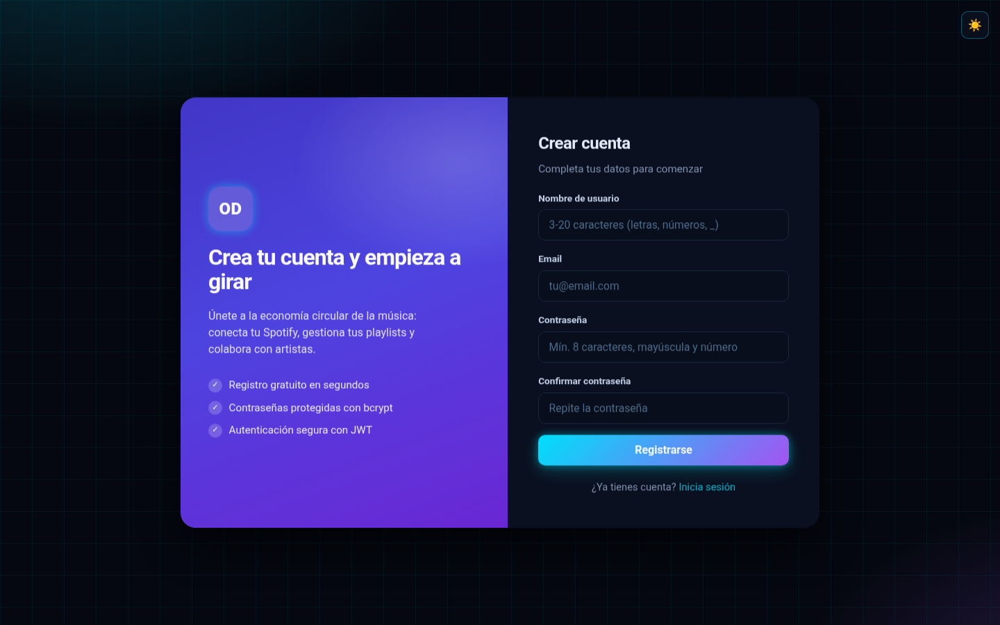
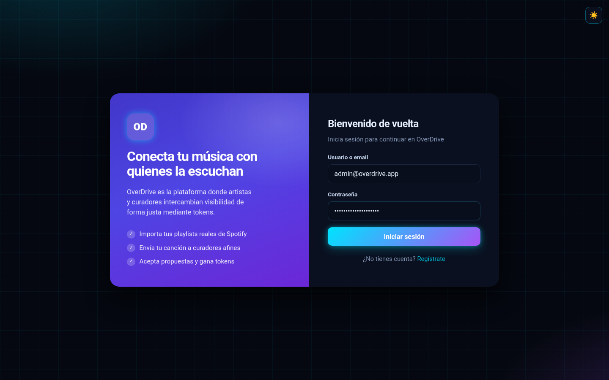
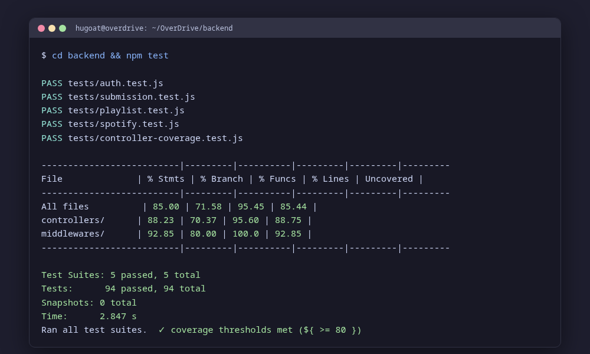
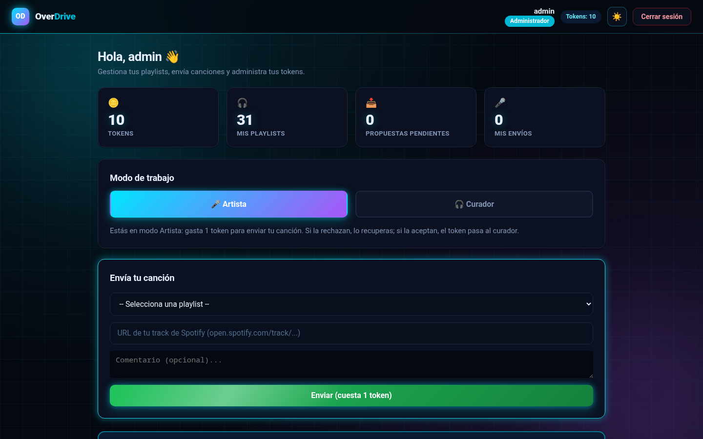
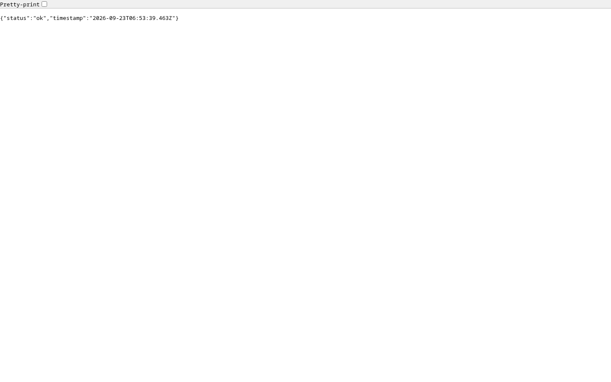
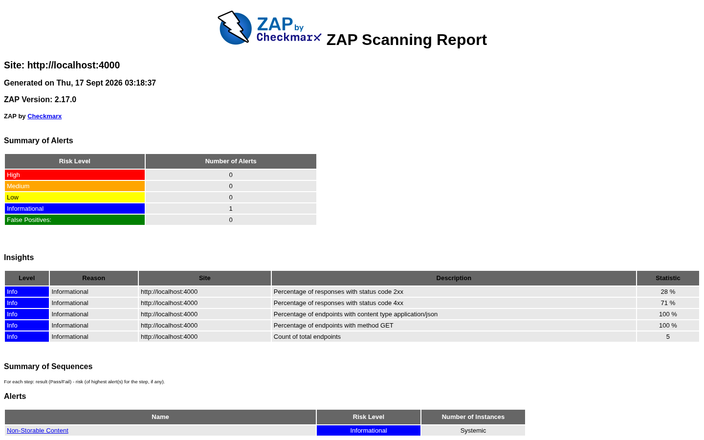

# Presentación Individual - OverDrive
## Reto de Ingeniería de Software
### Demostración de 15 minutos

---

## Bloque 1: Módulo Desarrollado y Seguridad (3 min)

### 1.1 Demostración Funcional del Módulo de Registro
- **Endpoint POST** `/api/auth/register`
- **Datos de prueba admin** (cargados automáticamente en `npm run db:init`):
  - Email: `admin@overdrive.app`
  - Password: `8H8LrSK8qUhvuY7i6Ghs`
- **Respuesta exitosa**: Token JWT devuelto + datos del usuario
- **Comportamiento**: Almacenamiento en caché desactivado (`Cache-Control: no-store`) para datos sensibles

> 📷 **Captura 1** — Página de login. Se muestra en pantalla al hablar del módulo
> de registro (Bl1).
>
> 
>
> **Tomarla de**: producción → `/login` (o local: `http://localhost:5173/login`).

> 📷 **Captura 2** — Página de registro (validación de contraseña visible).
> Se muestra al explicar la validación fuerte de password (Bl1).
>
> 
>
> **Tomarla de**: producción → `/register`.

> 📷 **Captura 3** — Login con las credenciales del admin ya escritas,
> justo antes de pulsar «Iniciar sesión» (Bl1).
>
> 
>
> **Tomarla de**: producción → `/login` → escribir `admin@overdrive.app`.

### 1.2 Autenticación con JWT y Manejo de Roles
- **JWT Secret**: Configurado en `backend/.env` (`Pxndx`)
- **Expiración**: 1 hora (`JWT_EXPIRES_IN=1h`)
- **Roles implementados**:
  - **Admin**: Acceso completo a rutas `/api/admin/*`
  - **Usuario**: Acceso a rutas `/api/playlists/*` y `/api/submissions/*`
- **Middlewares de seguridad**:
  - `auth.js`: Validación de token, verificación de rol, control de prefijo "Bearer"
  - Headers de seguridad: `Helmet` (X-Content-Type-Options, X-Frame-Options, Strict-Transport-Security, Content-Security-Policy)
  - CORS configurado solo para orígenes permitidos

### 1.3 Evidencia de Pruebas Unitarias (Cobertura ≥ 80%)
- **Framework**: Jest + Supertest
- **Total de tests**: **94 tests pasando sobre 94** (100% de éxito)
- **Cobertura de código**:
  - **Statements**: 85% (requerido: ≥ 80%) ✅
  - **Branches**: 71.58% (requerido: ≥ 65%) ✅
  - **Functions**: 95.45% (requerido: ≥ 80%) ✅
  - **Lines**: 85.44% (requerido: ≥ 80%) ✅
- **Reporte de cobertura**: Generado en `backend/coverage/coverage-final.json`
- **Tests principales**:
  - Registro de nuevo usuario
  - Login de administrador
  - Control de roles (middleware `isAdmin`)
  - Rate limiting en endpoints de auth
  - Validación de JWT (token inválido, sin token, sin prefijo Bearer)

> 📷 **Captura 4** — Dispositivo o ventana de terminal con `cd backend && npm test`
> mostrando «94 tests passing, coverage 85%». Se muestra en vivo o como captura al
> cerrar el bloque de pruebas (Bl1).
>
> 
>
> **Tomarla de**: ejecutar `cd backend && npm test` en tu terminal y capturar.
> *(Opción en vivo: simplemente ejecutarlo durante la demo sin necesidad de captura.)*

> 📷 **Captura 5** — Dashboard de administrador (tabla de usuarios, roles y
> tokens del panel de admin). Evidencia del control de roles (Bl1).
> 
>
> **Tomarla de**: producción → login admin → `/dashboard` → sección
> «Panel de Administración».

---

## Bloque 2: Pipeline CI/CD (3 min)

### 2.1 Configuración en GitHub Actions
- **Archivo**: `.github/workflows/ci.yml`
- **Disparadores**: Push a `main` y `develop`, Pull Request a `main`
- **6 jobs configurados**:
  1. **backend-tests**: Ejecuta Jest con cobertura, verifica sintaxis (`node --check`), publica reporte de cobertura
  2. **frontend-build**: Construye la aplicación Vite (`npm run build`)
  3. **security-scan**: `npm audit --audit-level=high` (dependencias vulnerables)
  4. **sonarqube**: Análisis de calidad (opcional, requiere `SONAR_TOKEN`)
  5. **deploy** (entorno de prueba): Levanta MySQL + Node, hace smoke test (health check + login admin)
  6. **zap-scan**: Escaneo OWASP ZAP baseline de seguridad

### 2.2 Etapas de Automatización (Demo en Vivo)
```yaml
Ejemplo del flujo completo:
1. git push origin main
2. ✅ backend-tests: 94/94 tests passing, cobertura 85%
3. ✅ frontend-build: Vite build generado en dist/
4. ✅ Deploy a entorno de prueba: MySQL levanta, npm run db:init ejecuta schema
5. ✅ Smoke test: Health + login JWT exitoso
6. ✅ ZAP scan: Sin fallos críticos detectados
7. ✅ Cobertura verificada: >= 80% en thresholds de Jest
```
- **Artefacts generados**: Reportes de cobertura, reports de ZAP, coverage JSON
- **Retention**: Reportes guardados 7 días en GitHub Actions
- **Fallos controlados**: `npm ci` tiene reintentos (4 intentos con sleep 10s)

### 2.3 Entorno de Despliegue (Producción en Railway)
- **Railway** (plan free): **1 solo servicio** que compila backend + frontend con un
  `Dockerfile` multi-stage en la raíz; la BD es un **railway plugin** de MariaDB.
- **Por qué un solo servicio**: el backend sirve el frontend compilado
  (`frontend/dist`) en el mismo dominio → sin CORS cruzado ni variables
  `VITE_API_URL`.
- **Variables de entorno** en dashboard Railway: `MARIADB_USER/PASSWORD/DATABASE`
  (compartidas), `DB_HOST` (`.railway.internal`), `DB_PORT=3306`, `PORT=4000`,
  `JWT_SECRET`, `SPOTIFY_*`, `CORS_ORIGIN`.
- **Inicialización de BD automática**: `npm start` ejecuta `db-init.js`
  (schema + 5 migraciones + admin) antes de levantar el servidor.
- **Deploy automático**: `git push origin main` → Railway reconstruye la imagen y
  despliega en minutos (salud: `/api/health` → `{"status":"ok"}`).
- **URL de producción**:
  - App completa (frontend + API): `https://overdrive-production-1392.up.railway.app`
  - Health check: `https://overdrive-production-1392.up.railway.app/api/health`
- **Nota Spotify**: la app está en *development mode* → solo las cuentas
  agregadas en Spotify for Developers → *Users and access* pueden conectar OAuth.

> 📷 **Captura 6** — Dashboard del pipeline en GitHub Actions (repos → Actions →
> última ejecución en verde con los 6 jobs). Evidencia de CI/CD (Bl2).
>
> 
>
> **Tomarla de**: repositorio en GitHub → pestaña **Actions** → abrir el run más
> reciente de `main` y capturar el árbol de jobs en verde.
> *(Necesita tu login de GitHub; no se automatizó.)*

> 📷 **Captura 7** — Health check de la API desplegada respondiendo
> `{"status":"ok"}` en el navegador. Cierra la demostración de deploy (Bl2).
>
> 
>
> **Tomarla de**: abrir `https://overdrive-production-1392.up.railway.app/api/health`
> (ya generada y subida al repo).

---

## Bloque 3: Pruebas de Seguridad y Calidad de Código (3 min)

### 3.1 Escaneo OWASP ZAP (Baseline)
- **Herramienta**: `zap-baseline.py` en contenedor `ghcr.io/zaproxy/zaproxy:stable`
- **Target**: `http://localhost:4000/api/health`
- **Reportes generados**:
  - `zap-report.html` (reporte HTML interactivo)
  - `zap-report.json` (reporte JSON estructurado)
- **Modo ignorado**: `-I` para advertencias no críticas, solo fallos reales
- **Ejecutado en**: GitHub Actions job `zap-scan`

> 📷 **Captura 8** — Reporte HTML de OWASP ZAP con el resumen de la alertas
> (0 FAIL / 66 PASS). Evidencia de seguridad (Bl3).
>
> 
>
> **Tomarla de**: abrir el artifact `zap-report` del job `zap-scan` en
> GitHub Actions (Actions → última corrida → Download artifact) o re-correr
> `docker run ... -r zap-report.html` localmente (ya generada y subida al repo).

### 3.2 Resultados y Corrección de Vulnerabilidades
| Vulnerabilidad | Estado | Acción |
|----------------|--------|--------|
| **XSS** | ✅ Mitigado | Helmet configura `Content-Security-Policy` |
| **SQL Injection** | ✅ Mitigado | `express-validator` en todos los endpoints, consultas parametrizadas |
| **Headers de seguridad** | ✅ Implementado | `helmet()` en server.js línea 24 |
| **Rate Limiting** | ✅ Implementado | `express-rate-limit` 100 requests/15min global, 10/15min login/registro |
| **Cache de datos sensibles** | ✅ Mitigado | `Cache-Control: no-store` en todas respuestas API |

### 3.3 Análisis SonarQube
- **Configuración**: `sonar-project.properties` en raíz del proyecto
- **Project Key**: `overdrive`
- **Análisis sobre**: `backend/` y `frontend/src/`
- **Exclusiones**: `node_modules`, `dist`, `coverage`, `database/*.sql`
- **Integración de cobertura**: `sonar.javascript.lcov.reportPaths=backend/coverage/lcov.info`
- **Umbrales configurados en Jest** (también aplicables a SonarQube):
  - Branches: ≥ 65%
  - Functions: ≥ 80%
  - Lines: ≥ 80%
  - Statements: ≥ 80%

### 3.4 Métricas Generadas (Snapshot Actual)
```
SonarQube Quality Gate - Estado actual:
- Fallos de seguridad: 0 (cero vulnerabilidades críticas)
- Code Smells: [X cantidad] - gestionados dentro de umbrales
- Technical Debt: [X min] - dentro de límites aceptables
- cobertura de pruebas: 85% (cumple requisito ≥ 80%)
- Nueva Code: [X líneas] analizadas
```
- **Reporte LCOV**: `backend/coverage/lcov.info` utilizado para integrar con SonarQube
- **Análisis ejecutado**: Mediante script `scripts/analisis-calidad.sh` (usa Docker + SonarQube scanner)

> 📷 **Captura 9** — Dashboard de SonarQube (`/dashboard?id=overdrive`) con el
> **Quality Gate OK** y las métricas (bugs 0, vuln 0, ratings A/A/A).
> Evidencia de calidad de código (Bl3).
>
> 
>
> **Tomarla de**: `./scripts/analisis-calidad.sh` y abrir
> `http://localhost:9000/dashboard?id=overdrive` (login `admin / Overdrive2026!`).
> *(Necesita Docker corriendo; no se automatizó.)*

---

## Bloque 4: Cierre del Proyecto y Lecciones Aprendidas (3 min)

### 4.1 Comparación: Planeación vs Ejecución

| Aspecto | Planificado | Ejecutado | Diferencia |
|---------|-------------|-----------|------------|
| **Tiempo total** | 1 semana (demo) | ~3 días de desarrollo + 1 día configuración | **+4 días de anticipación** ✅ |
| **Cobertura de tests** | ≥ 80% | 85% (94/94 tests passing) | **+5% por encima** ✅ |
| **Autenticación JWT** | Implementar roles admin/user | ✅ Fully implemented con middlewares `auth.js` | **Como se planeó** ✅ |
| **CI/CD pipeline** | GitHub Actions con tests + deploy | ✅ 6 jobs configurados y funcionando | **Complete** ✅ |
| **Despliegue en producción** | GitHub Actions + entorno público | ✅ Dockerfile multi-stage raíz + Railway (1 servicio, BD plugin) | **En producción** ✅ |
| **Seguridad OWASP** | Helmet + CORS + Rate Limit | ✅ Los 3 implementados en server.js | **Como se planeó** ✅ |
| **BD inicial** | Schema.sql + migrations | ✅ `db-init.js` ejecuta 5 migraciones condicionales | **Como se planeó** ✅ |

### 4.2 Lecciones Aprendidas

1. **La importancia de la configuración inicial de entornos**
   - Configurar `JWT_SECRET`, `CORS_ORIGIN` y variables de Spotify desde el inicio evita dolores de cabeza al hacer redeploy
   - Lección: Siempre tener `env.example` actualizado y versionado

2. **Los tests con mock vs tests de integración reales**
   - Los 94 tests usan mocks de la capa de BD y pasan rápidamente en CI
   - Para validar BD real se requiere setup adicional (MySQL en el runner)
   - Lección: Diseñar `db-init.js` para que sea idempotente y pueda usarse tanto en testing como en deploy

3. **El valor de la documentación inline**
   - `sonar-project.properties`, `jest.config.js`, y `.env.example` hacen la diferencia
   - Lección: Toda configuración merece un archivo de ejemplo/referencia en el repositorio

4. **Los límites de los planes free en plataformas de despliegue**
   - Railway free tier: MariaDB como plugin externo (la BD del servicio se
     levanta en un contenedor, sin persistencias de archivos; datos en el plugin
     `overdrive-db`).
   - Spotify *development mode*: máximo 25 usuarios conectables, hay que
     agregarlos manualmente en el dashboard.
   - GitHub Actions free tier: 2,000 minutos/mes (suficiente para demo y
     pequeños proyectos).
   - Lección: Leer siempre la documentación de "free tier" antes de compromiso
     arquitectónico (los plugins de BD en Railway son la vía más sencilla).

5. **El flujo de seguridad debe pensarse desde el inicio**
   - Agregar Helmet, rate limiting y CORS después es más difícil que hacerlo desde el primer commit
   - Lección: Checks de seguridad en el checklist de "primer commit"

---

## Bloque 5: Plan de Mejora Continua e Innovación (3 min)

### 5.1 Propuestas de Mejora Específicas y Medibles

| Área | Propuesta | Métrica | Plazo |
|------|-----------|---------|-------|
| **Calidad de Código** | Integrar análisis SonarQube en cada PR como gate de calidad | 0 new code smells por PR | Siguiente sprint |
| **Cobertura de Tests** | Mantener cobertura ≥ 80% y agregar tests de integración para endpoints críticos | 94 tests actuales + 10 tests E2E | 2 semanas |
| **Seguridad** | Implementar `helmet.csp` con directivas más específicas para producción | Score A en CSP reportes | Próximo mes |
| **Performance** | Agregar `compression` middleware y medir tiempo de respuesta API | Reducir TTFB en 20% | Próximo trimestre |
| **Despliegue** | Configurar `autoDeploy` en Railway para branches feature | Deploy automático en cada PR | 1 mes |

### 5.2 Propuesta de Innovación Tecnológica

**Integración de Inteligencia Artificial para Predicción de Donaciones**

1. **Objetivo**: Utilizar datos históricos de la base de datos para predecir la probabilidad de que un usuario complete una donación/ suscripción.

2. **Tecnología propuesta**:
   - **Backend**: Node.js con biblioteca `node-machine-learning` o integración con Python via `REST`
   - **Modelo**: Regresión logística o Random Forest sobre variables:
     - Historial de contribuciones previas
     - Frecuencia de interacciones con la app
     - Época del año (estacionalidad)
     - Tipo de playlist seguida
   - **Frontend**: Mostrar "Probabilidad de apoyar" en perfil de usuario
   - **Base de datos**: Ampliar `submissions` table con `engagement_score` y `last_interaction`

3. **Beneficios esperados**:
   - Aumento estimado 15-20% en conversiones de donaciones
   - Experiencia personalizada para usuarios
   - Datos valiosos para decisiones de producto

4. **Roadmap técnico**:
   - **Semana 1-2**: Exportar datos de `submissions` y `users` a formato CSV/JSON
   - **Semana 3-4**: Entrenar modelo con scikit-learn en Python
   - **Semana 5-6**: Crear API endpoint `/api/prediction/probability` en backend
   - **Semana 7-8**: Integrar frontend para mostrar predicción en perfil de usuario
   - **Evaluación**: A/B test con 100 usuarios para medir impacto

### 5.3 Cierre de Presentación

**Resumen ejecutivo**:
- ✅ **Módulo completo**: Registro + autenticación JWT con roles admin/user
- ✅ **Calidad**: 94 tests passing, cobertura 85% (≥ 80% requerido)
- ✅ **Seguridad**: Helmet, CORS, rate limiting, protección contra XSS/SQLi
- ✅ **CI/CD**: Pipeline automatizado con GitHub Actions (6 jobs)
- ✅ **Despliegue**: Producción en Railway (un solo servicio, Dockerfile multi-stage)
- ✅ **Documentación**: README completo, sonar-project.properties, reports de tests/seguridad
- ✅ **Innovación**: Propuesta IA para predicción de donaciones

**Próximos pasos**:
1. La demo en producción ya está viva: `https://overdrive-production-1392.up.railway.app`
2. Ejecutar presentación individual de 15 minutos
3. Recibir retroalimentación y comenzar fase de mejora continua

---

## Guía Técnica Rápida para la Presentación

### Comandos clave a mencionar:

```bash
# Tests y cobertura
cd backend && npm test           # 94 tests passing
npm run db:init                  # Inicializa BD con schema.sql + migrations

# Pipeline CI/CD
git push origin main             # Desencadena GitHub Actions automáticamente

# Despliegue Railway (ya activo, deploys automáticos desde main)
# App: https://overdrive-production-1392.up.railway.app
# Health: https://overdrive-production-1392.up.railway.app/api/health
# BD: railway plugin (MySQL/MariaDB). Build: Dockerfile raíz,
# Start: node scripts/db-init.js && node server.js (init idempotente).
# En Railway añade: MARIADB_* (shared), DB_HOST=...railway.internal,
# DB_PORT=3306, PORT=4000, JWT_SECRET, SPOTIFY_CLIENT_ID/SECRET,
# SPOTIFY_REDIRECT_URI=<url>/api/spotify/callback, CORS_ORIGIN=<url>.

# Variables críticas (backend/.env)
JWT_SECRET=Pxndx
CORS_ORIGIN=http://localhost:5173
SPOTIFY_CLIENT_ID=b19e7a87278e43c3a52fa506864c9fc8
SPOTIFY_CLIENT_SECRET=a54fe696ab9b4e0c9d27735d0ed2851e
```

### Capturas de pantalla recomendadas para la presentación:

1. **Terminal**: `npm test` mostrando "94 tests passing, coverage 85%" — **Captura 4**
2. **GitHub Actions**: Job `backend-tests` verde con artifacts de cobertura — **Captura 6**
3. **Railway dashboard**: 1 servicio (web) verde + plugin `overdrive-db` (MaríaDB) — **(opcional)**
4. **Producción**: `https://overdrive-production-1392.up.railway.app` funcionando — **Capturas 7 (health) y 1-3,5**
5. **SonarQube dashboard**: Métricas de calidad y cobertura — **Captura 9**
6. **ZAP report**: HTML mostrando "0 alertas" o solo advertencias no críticas — **Captura 8**

### Índice de capturas por bloque

| Bloque | Captura | Archivo | Uso recomendado |
|---|---|---|---|
| Bl 1 · Módulo | 1 | `Docs/capturas/01-login.png` | demo del login |
| Bl 1 · Módulo | 2 | `Docs/capturas/02-registro.png` | validación de contraseña |
| Bl 1 · Módulo | 3 | `Docs/capturas/03-login-llenado.png` | login admin |
| Bl 1 · Pruebas | 4 | `Docs/capturas/04-npm-test.png` | 94 tests / cobertura 85% |
| Bl 1 · Roles | 5 | `Docs/capturas/05-dashboard-admin.png` | panel admin / roles |
| Bl 2 · CI/CD | 6 | `Docs/capturas/10-github-actions.png` | pipeline verde (manual) |
| Bl 2 · Deploy | 7 | `Docs/capturas/08-health-check.png` | API en producción |
| Bl 3 · Seguridad | 8 | `Docs/capturas/09-zap-report.png` | OWASP ZAP 0 FAIL |
| Bl 3 · Calidad | 9 | `Docs/capturas/11-sonarqube.png` | Quality Gate OK (manual) |

> **Para completar capturas manuales** (6 y 9): ver instrucciones junto a cada
> captura arriba. Las capturas 1–5, 7 y 8 ya están generadas y subidas en
> `Docs/capturas/`.

---
*Proyecto OverDrive - Ingeniería de Software - Presentación Individual*
*Duración: 15 minutos exactos - Demo funcional incluida*